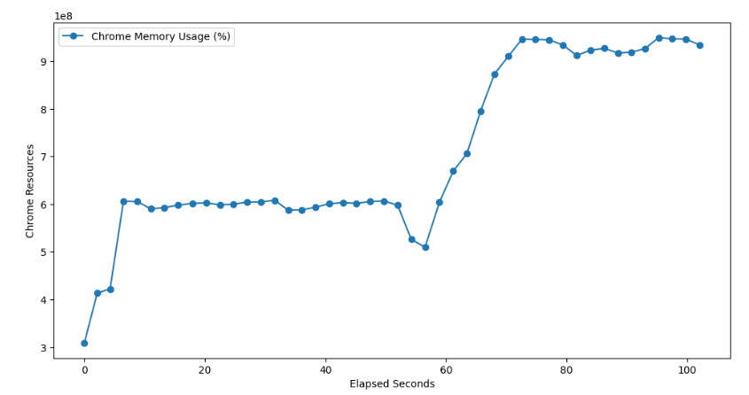

# OHIF Stress/Fuzz test

Simulate heavy usage of the Open Health Imaging Foundation (OHIF) zero-footprint medical image viewer.

Date: 12/19/2023

Fulmine Labs LLC

## Overview

The problem: The current automated tests of the excellent, open source, OHIF Basic Viewer are mainly functional in nature [(unit and end-to-end)](https://docs.ohif.org/development/testing).
In order to flush out any issues and increase confidence in the stability of this interface, it would be good to extend the available automated tests to also cover non-functional scenarios, such as performance. 

This Python/Selenium code, run from Jupyter notebook or Jupyter lab, performs a set of pseudo-randomized (fuzz) actions on the OHIF Basic Viewer across a number of studies. 

The script has the capabilty of graphing resource usage.

The number of iterations of the actions on each study and the number of studies can be tuned such that the script simulates heavy, but somewhat realistic usage of this interface over a period of time that simulates a long usage session (for example 8+ hours). 

The test logs resource usage during these iterations, which can be graphed after test completion.

In order for the test actions to run quickly and minimize user interface dependencies, which can be a notorious issue with UI based tests, there are no explicit verifications during the test. Therefore a passed test consists of: 
1) Completion of all iterations without encountering stability issues in the interface. This can be confirmed after a completed run by checking the test logs for unexpected conditions.
2) Non-increasing resource usage, after the initial startup.

## Current Version
The current stable version of the project is 0.1.0 See the [CHANGELOG.md](./CHANGELOG.md) for details about this release.

## Prerequisites

Anaconda, with an environment having the Python libraries listed in [requirements.txt](./requirements.txt)
Brave
Chrome
Access to the OHIF Viewer website at: https://viewer.ohif.org/

## Usage

1) Install Anaconda
2) Install the Brave and Chrome browers, if they are not already present
3) Clone the OHIF-stress-fuzz-test repository to your local machine and navigate to the cloned directory in Anaconda Powershell Prompt: 'cd LNRoutingVizualization'
4) Install the dependencies listed in requirements.txt with `'pip install -r requirements.txt'`
5) Open Jupyter Notebook or Jupyter Lab from Anaconda. It should start in Brave.
6) Open _OHIF stress fuzz test.ipynb_ from the cloned directory inside Jupyter
7) Edit any test parameters in the first cell, as needed. Currently, the following parameters can be set:
* Random _seed_ Set to _None_ for a random seed or use a seed from a previous run for repeatability. The seed is recorded in the log file for the run.
* _verbose_, True or False. True will enable logging in Jupyter Notebook, but all message will be logged to the log file for the run.
* _study_count_ and _action_count_. The number of studies to select and actions to perform on each study.
9) In Jupyter, 'Run All Cells'

## Screenshots/Recordings

If successful the running test should look something like this:

The test records resource usage and on completion will create plots of:
1) System CPU and memory usage
2) The system handle count
3) Chrome browser memory usage (see below)

## Testing

This code was run in Jupyter Notebook and Jupyter Lab from Anaconda 2.5.1 on Windows 11. 
The test was run from a Jupyter Lab session in Brave 1.61.104 and the target was Chrome Version 120.0.6099.110 (Official Build) (64-bit)
OHIF Worklist, Basic Viewer from https://viewer.ohif.org/, version 3.7.0.

## Known issues

## Acknowledgements

* This code was written collaboratively with GPT-4V. Thank you Assistant!
* The Open Health Imaging Foundation

## License

[MIT open source license](LICENSE.txt)

## Collaboration

We welcome contributions at all levels of experience, whether it's with code, documentation, tests, bug reports, feature requests, or other forms of feedback. If you're interested in helping improve this tool, here are some ways you can contribute:

- **Ideas for Improvements**: Have an idea that could make the OHIF Stress Fuzz test better? Open an issue with the tag `enhancement` to start a discussion about your idea.
- **Bug Reports**: Notice something amiss? Submit a bug report under issues, and be sure to include as much detail as possible to help us understand the problem.
- **Feature Requests**: If you have a suggestion for a new feature, describe it in an issue with the tag `feature request`.
- **Documentation**: Good documentation is just as important as good code. Although this is currently a very simple tool, if you'd like to contribute documentation, we'd greatly appreciate it.
- **Code**: If you're looking to update or write new code, check out the open issues and look for ones tagged with `good first issue` or `help wanted`.

## Contact

Duncan Henderson, Fulmine Labs LLC
henderson.duncanj@gmail.com

